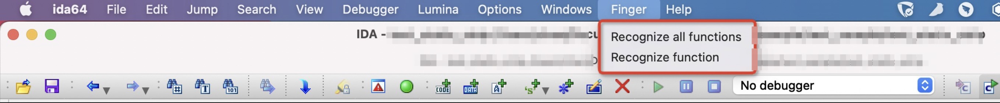
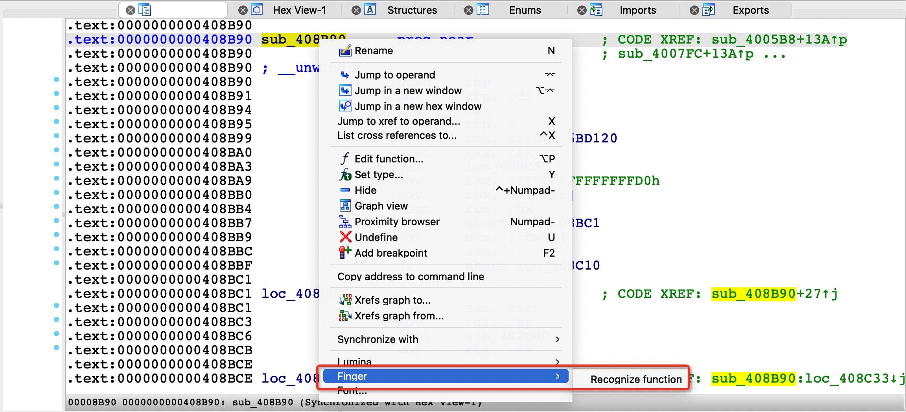
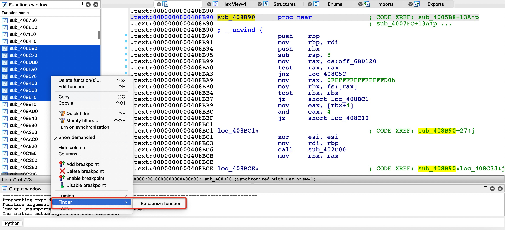
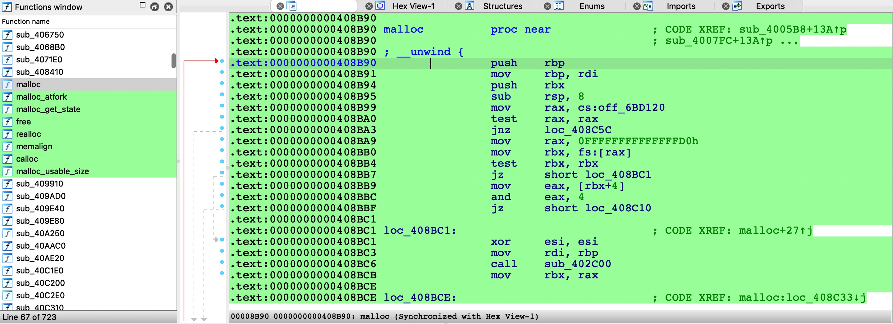

# Finger Multi-threading

An improved version of brilliant ida plugin finger, fixed 'always pop up' issue and implemented multi-threading to accelerate the recognition process.

**IMPORTANT: THIS PLUGIN IS STILL UNDER TEST！**

## Installation

* Always pull this git or download `finger_plugin_complete.py`, release may be out-of-date.
* Paste `finger_plugin_complete` under `\plugins\`, no further actions needed.
* **This plugin shall not been co-exist with old finger plugin **

## Known issue

* After running the plugin, your IDA will stuck into no-response status, it takes time depends on your functions count. （UI Completed)
  You can change thread count in source file:

  ```python
  #finger_plugin_complete.py: 277
  #-------------------------------
      def recognize_selected_function(self, funcs):
          try:
              self.string_pool = idautils.Strings()
  
              #idaapi.msg("[D]FingerManager:recognize_selected_function\n")
              #modify this constant to allocate more threads.
              threads_count = 16
  ```
  
* Sometimes due to remote server SSL problem, you will receive exception:

  ```
  requests.exceptions.SSLError: HTTPSConnectionPool(host='sec-lab.aliyun.com', port=443): Max retries exceeded with url: /finger/recognize/ (Caused by SSLError(SSLEOFError(8, 'EOF occurred in violation of protocol (_ssl.c:1131)')))
  ```

  Most of time this is normal. If it in deed influenced your project , try using fewer threads. This may due to remote denial of services problem, when may be issued by too many requests.
  
* **`TypeError: object of type 'map' has no len()`** 

  Manually modify `finger_plugin_complete.py`  
``` python
       # funcs = map(idaapi.getn_func, ctx.chooser_selection) # old
         funcs = list(idaapi.getn_func, ctx.chooser_selection)  # new
```


-----
# Finger
Finger, a tool for recognizing function symbol.

## Overview
Finger is a function symbol recognition engine for binary programs developed by Alibaba Cloud · Cloud Security Technology Lab, which aims to help security researchers identify unknown library functions in a given binary file.
Finger provides two ways to access core APIs of Finger function symbol recognition engine.

## Running environment
Now, Finger support python 2.7 and python 3, and requires IDA version >= 7.0.

## Finger python SDK
The python version must be the same as your IDAPython version.
~~~
pip install finger_sdk
~~~
After installing finger python SDK, you can check out the finger/exampls/recognize.py for more information.

*In fact, if you are using my fork, this sdk is not needed anymore.*

## Finger IDA Plugin
Copy plugin/finger_plugin.py to your IDA_PATH/plugins path.
### upload function
The Finger IDA plugin supports single function, selected function, and all functions recognition. You can recognize function symbols in the menu bar, disassembly window, and function window.

Use Finger IDA plugin in the menu bar:


Use Finger IDA plugin in the disassembly window:


Use Finger IDA plugin in the function window:


### function symbol presentation
The successfully recognized function symbols will be highlighted in the disassembly window and function window.

